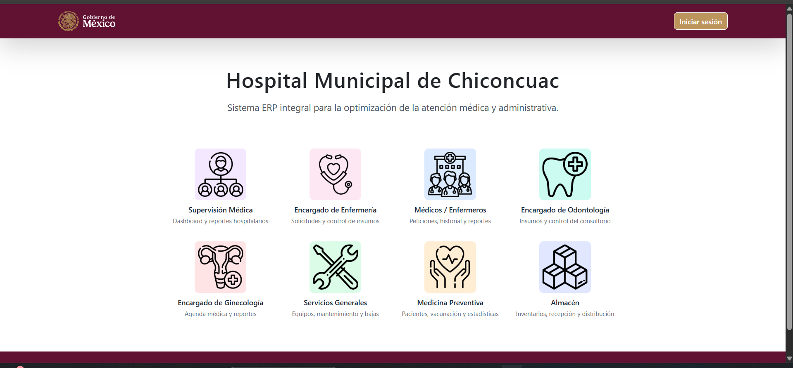
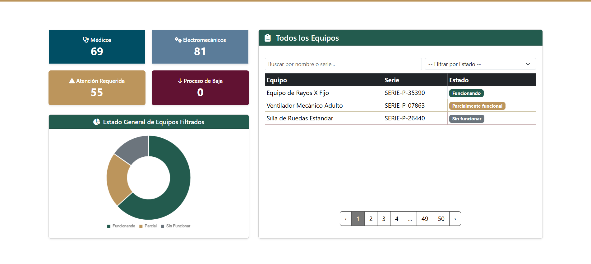
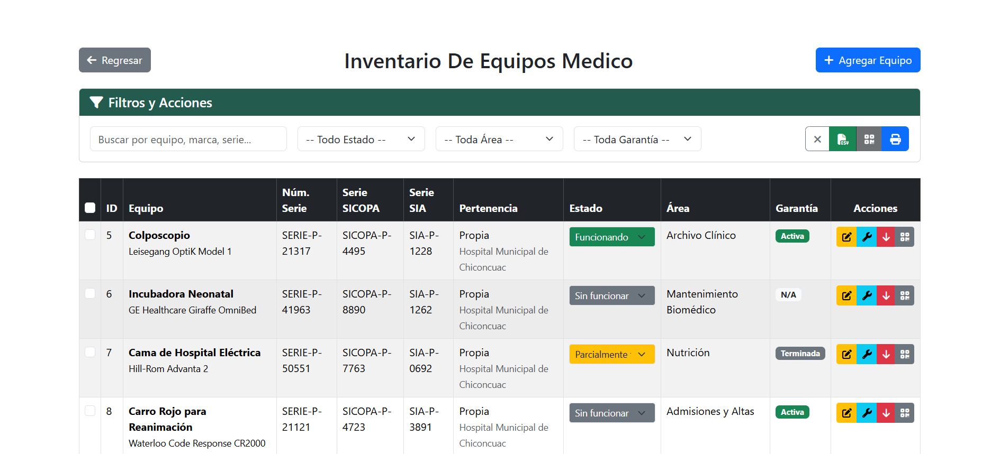
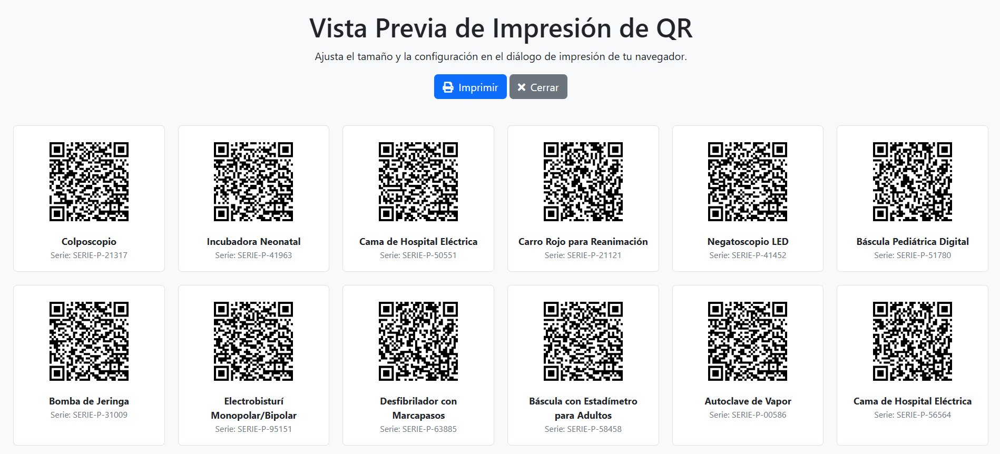
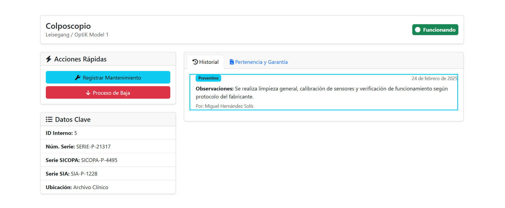
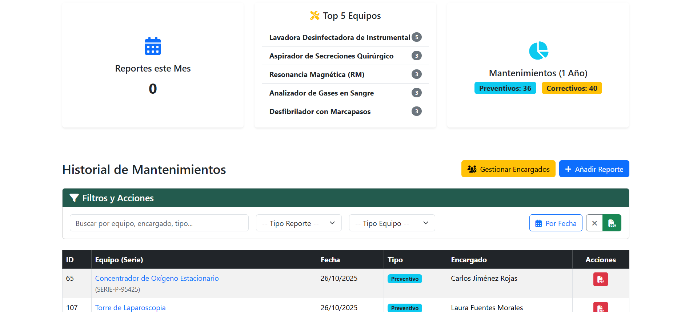
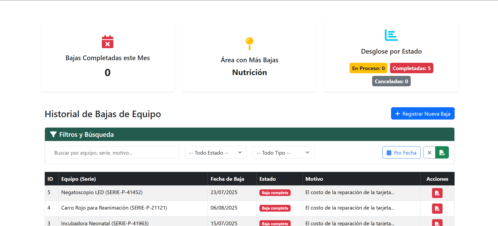

# Sistema ERP Hospitalario - Módulo de Servicios Generales 🏥

> **Proyecto:** Sistema Integral para el H. Ayuntamiento de Chiconcuac.
> **Rol:** Ingeniero Full Stack (Módulo de Infraestructura y Equipo Médico).

## 📖 Descripción del Proyecto
Este sistema es un ERP modular desarrollado para optimizar la gestión administrativa y médica del **Hospital Municipal de Chiconcuac**.

Mi responsabilidad principal fue el diseño y desarrollo del módulo de **Servicios Generales**, encargado de la gestión del ciclo de vida de los activos hospitalarios (desde incubadoras hasta equipos de rayos X). El sistema resuelve la problemática del control de inventario, trazabilidad de mantenimiento y auditoría de equipos mediante tecnologías digitales.

---

## 📸 Tour Visual & Funcionalidades

### 1. Arquitectura Modular y Dashboard
El sistema cuenta con una arquitectura escalable dividida por departamentos. El Dashboard proporciona métricas en tiempo real sobre el estado operativo de los equipos (Funcionando, Parcial, Sin Funcionar), permitiendo la toma de decisiones rápida por parte de la dirección.

| Menú Principal de Módulos | Dashboard de Servicios Generales |
|:---:|:---:|
|  |  |

### 2. Gestión de Inventario Inteligente
Tabla dinámica desarrollada con **Livewire** que permite filtrado instantáneo por estado, área o garantía.
* **Semáforo de Estados:** Indicadores visuales para identificar equipos críticos.
* **Acciones Rápidas:** Acceso directo a edición, reportes de mantenimiento, procesos de baja y generación de QR.
* **Exportación de Datos:** Generación de reportes en CSV para auditorías externas.

### 3. Sistema de Trazabilidad con Códigos QR 📱
Implementé un sistema de generación dinámica de QRs para cada activo fijo.
* **Impresión Flexible:** El usuario puede seleccionar lotes específicos de equipos (ej. "Solo el área de Urgencias") o imprimir etiquetas individuales.
* **Escaneo Móvil:** Al escanear el código físico pegado en el equipo, el personal accede a una **Vista Móvil (PWA)** que muestra el historial clínico del aparato, últimos mantenimientos y ubicación, sin necesidad de buscar en una PC.

| Generación de Etiquetas (Batch) | Vista Móvil al Escanear |
|:---:|:---:|
|  |  |

### 4. Control de Mantenimientos y Bajas
Digitalización completa de las bitácoras de servicio.
* **Historial Clínico del Equipo:** Registro detallado de mantenimientos preventivos y correctivos.
* **Gestión de Bajas:** Flujo de aprobación para retirar equipos obsoletos, documentando el motivo (costo de reparación, antigüedad) para transparencia administrativa.
* **Reportes PDF:** Generación automática de actas administrativas en formato PDF listas para firmar.

| Historial de Mantenimientos | Control de Bajas |
|:---:|:---:|
|  |  |

---

## ⚙️ Retos Técnicos Resueltos

* **Generación PDF/QR Masiva:** Se optimizó el uso de memoria en el servidor para permitir la generación de cientos de códigos QR en un solo archivo PDF sin exceder el *timeout* de PHP.
* **Despliegue On-Premise:** Configuración de un entorno de producción en una red local (Intranet) utilizando **Ubuntu Server**, asegurando que el sistema fuera accesible desde cualquier consultorio sin depender de internet externo.
* **Reactividad con Livewire:** Implementación de componentes reactivos para búsquedas y filtros en tiempo real sin recargar la página (SPA feel), mejorando la experiencia de usuario en equipos con hardware limitado.

---

## 🛠 Stack Tecnológico

* **Backend:** PHP 8.2, Laravel 10.
* **Frontend:** Blade, Livewire, TailwindCSS, Alpine.js.
* **Base de Datos:** MySQL (Relacional optimizada con índices para búsquedas rápidas).
* **Servicios:** Librerías `dompdf` para reportes y `simple-qrcode` para generación matricial.
* **Infraestructura:** Virtualización en Ubuntu Server.

---

### 📬 Contacto
¿Te interesa saber más sobre la arquitectura de este proyecto?

